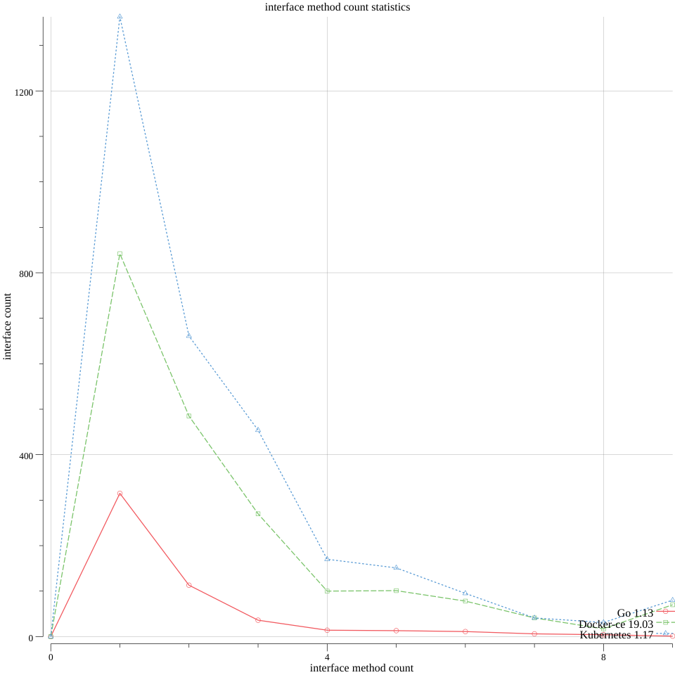

itfmc: count the number of an interface methods and output the statistics

The example below outputs the interfaces method statistics under \$GOROOT：

```
$ find $GOROOT -name '*.go'|grep -v "_test.go" |xargs cat| grep -v ^$|grep -v "^[[:space:]]*\/\/"|itfmc 2>/dev/null
a[0] = 13
a[1] = 315
a[2] = 113
a[3] = 36
a[4] = 14
a[5] = 13
a[6] = 11
a[7] = 6
a[8] = 4
a[9] = 1
a[11] = 1
a[12] = 2
a[13] = 1
a[16] = 1
a[17] = 1
a[31] = 1
interfaces in total = 533
interfaces in total by name= 314
```

* ```a[1] = 315``` means there are **315** interfaces which only has **one** method.
* ```a[2] = 113``` means there are **113** interfaces which only has **two** method.
* ... ...

The input data passed to itfmc should be follow these rules:
* no blank line: ```grep -v ^$```
* no comment line: ```grep -v "^[[:space:]]*\/\/"```


Here are the outputs of some famous go projects:

* Docer-ce 19.03:

```
$find /Users/tonybai/go/src/github.com/docker  -name '*.go'|grep -v "_test.go" |xargs cat| grep -v ^$|grep -v "^[[:space:]]*\/\/"|itfmc 2>/dev/null
a[0] = 7
a[1] = 842
a[2] = 485
a[3] = 270
a[4] = 100
a[5] = 101
a[6] = 78
a[7] = 41
a[8] = 17
a[9] = 70
a[10] = 46
a[11] = 15
a[12] = 17
a[13] = 10
a[14] = 5
a[15] = 8
a[16] = 5
a[17] = 4
a[18] = 3
a[19] = 1
a[20] = 2
a[21] = 4
a[22] = 1
a[23] = 1
a[24] = 1
a[27] = 2
a[29] = 3
a[31] = 3
a[32] = 1
a[34] = 1
a[38] = 4
a[39] = 1
a[52] = 1
interfaces in total = 2150
interfaces in total sort by name = 1281
```
* Kubernetes 1.17

```

$find /Users/tonybai/go/src/github.com/kubernetes/kubernetes -name '*.go'|grep -v "_test.go" |xargs cat| grep -v ^$|grep -v "^[[:space:]]*\/\/"|itfmc 2>/dev/null
a[0] = 12
a[1] = 1363
a[2] = 661
a[3] = 454
a[4] = 170
a[5] = 151
a[6] = 95
a[7] = 41
a[8] = 31
a[9] = 80
a[10] = 55
a[11] = 19
a[12] = 25
a[13] = 8
a[14] = 12
a[15] = 5
a[16] = 13
a[17] = 10
a[18] = 3
a[19] = 5
a[20] = 3
a[21] = 2
a[22] = 4
a[23] = 3
a[24] = 2
a[25] = 1
a[26] = 1
a[27] = 2
a[29] = 1
a[30] = 1
a[31] = 2
a[32] = 1
a[41] = 1
a[43] = 1
a[66] = 1
interfaces in total = 3239
interfaces in total sort by name = 2425
```


<center> image: stdlib vs. docker vs. kubernetes(generated by https://github.com/gonum/plot) </center>

